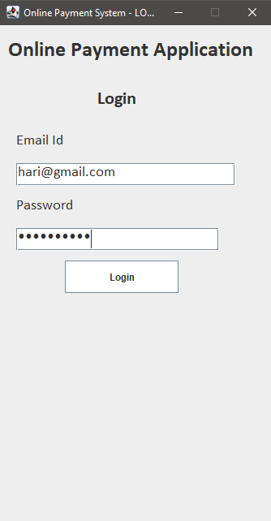
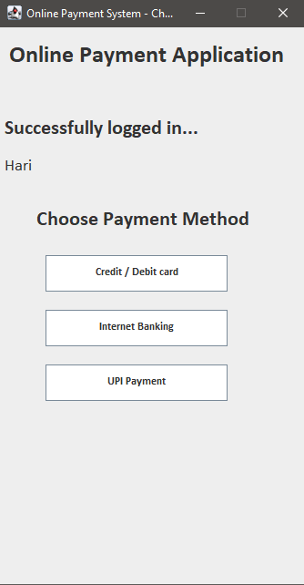
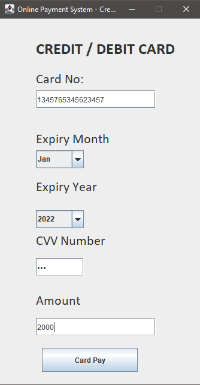
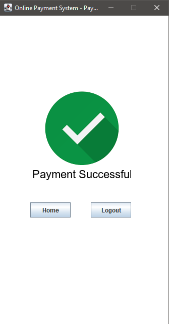
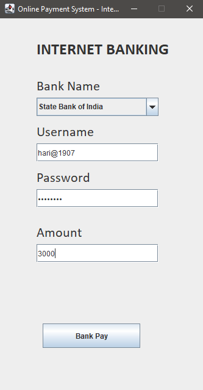
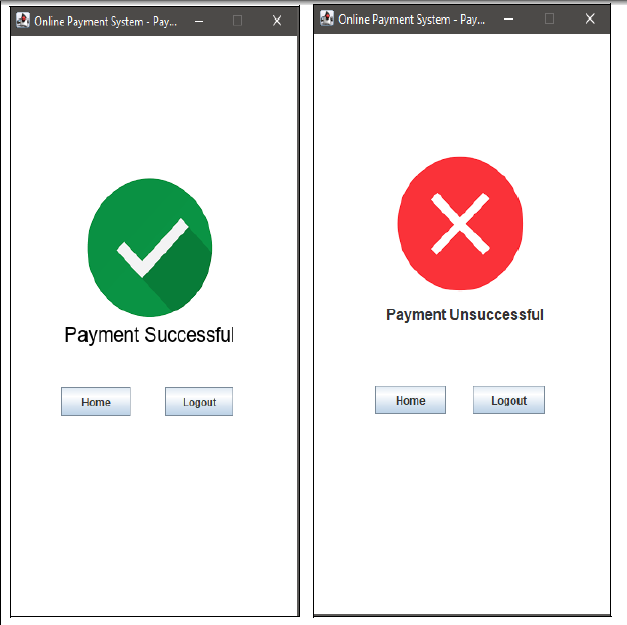

# Online-Payment-System-Swing-JDBC
 Desktop application for Online Payment System using Java SWING & JDBC

# Project Title :     Online Payment System

# Description

To build a mini project in GUI Version using Swing and any kind of database connection using JDBC. The Project should adopt all kinds of database operations. The project should have a validation enabled Registration & login page and at least four windows to do the online transaction with different modes of payment like Credit/Debit card, Internet Banking, UPI, etc. 

# Tools : 

Eclipse Java Developer version, Java JDK-19, Postgresql

# Modules : 

Registration Form, Login Form, Forgot Password Form, Payment mode choosing Form, Credit/Debit card - Payment mode, Internet Banking - Payment mode, UPI - Payment mode, Payment status page.

# Registration Form

In the Registration Module, we collect the user information like Username, EmailId, Password and these values stored to Database after pressing the “Register” Button after validating the OTP sent to the user’s mail id. The Validations are checked for Password Field. The Password should be greater than 8 characters. If the user already has an account, then the user can click the  “Sign in” button  and navigate the user to the Login Page.

# Login Form

In the Login Module, The user has to enter the EmailId and Password for Login. If the EmailId and Password are correct, then the user navigate to the next Page. If it is wrong, then the Error message is shown in the Login Page.

# Forgot Password Form

In the Forgot Password Module, The user can enter the new password and also have to enter the OTP sent to their mail id. Thus it provides a layer of security to protect the password & account.

# Payment mode choosing Form

In the Payment mode choosing module, The “SuccessFully Logged in” Message  is shown with the user’s name. And after that there are three types of Payment mode available:

Debit/Credit card
Internet Banking
UPI Payment

The user can select any one of the Payment modes for transactions. 

# Credit/Debit card - Payment mode

In the Credit / Debit card Module, The User has to give their respective card information like Card Number, Expiry Month and Year of the Card, CVV Number. For Choosing Expiry Month and Expiry Year, the list of the Months and Years are shown and the user has to select any one value. Then the user has to enter their Amount and Click the “Card Pay” button for Transaction. In this,  Validations are checked for Card Number and CVV Number. If the Card Number is greater than 16 digits and the CVV Number is not equal to 3 digits, then an Error Message is shown on the page. This application only allows transactions for amount less than Rs.5001/-. Finally, the Payment status page is Shown.
		 
# Internet Banking - Payment mode.

In the Internet Banking Module, The user has to select the Bank Name from the List of Banks. Then the user have to type their username & password of their respective internet banking credentials. Then they are allowed to make payment for the amount less than Rs.5001/-. Finally, The payment status page is shown.

# UPI - Payment mode.
             
In the UPI Payment Module, the user has to give their UPI credentials like UPI Id and UPI Pin. Then the user has to Enter the amount for Transaction.
The User are allowed to make payment for the amount less than Rs.5001/- Finally, The payment status page is shown.

# Payment status page

In the Payment Status Module, If the Transaction is Successful then the SuccessFull page is Shown. Otherwise UnSuccessful Page is Shown.

# Results 

# References

 https://docs.oracle.com/en/java/

https://www.drnishikantjha.com/papersCollection/Amazon%20Pay-BB%20Project-v1.pdf

https://www.oracle.com/in/database/technologies/appdev/jdbc.html

https://jdbc.postgresql.org/download/

https://docs.oracle.com/javase/7/docs/api/javax/swing/ImageIcon.html#:~:text=imageData%2C%20String%20description

https://github.com/javaee/javamail

https://www.studyviral.in/search/label/Sending%20Email

